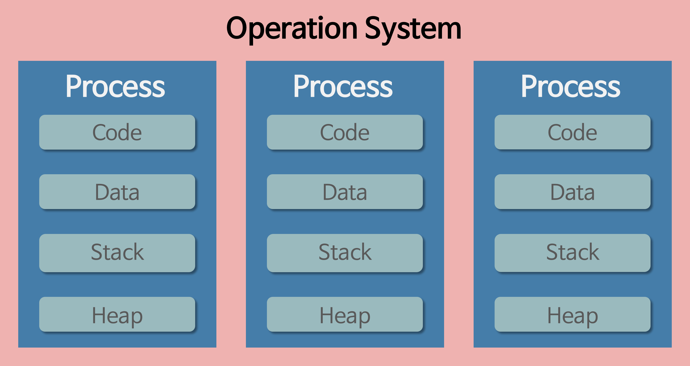

## 프로그램, 프로세스, 스레드
### 프로그램
- 어떤 작업을 위해 실행할 수 있는 파일
- 저장 장치에 저장돼 있으나 메모리에는 올라가 있지 않은 정적인 상태
  > 모든 프로그램은 메모리 공간이 할당돼야 실행 가능함. 프로그램은 운영체제가 독립적인 메모리 공간을 아직  할당 하지 않았음(정적인 상태).
- 실행되지 않은 파일/코드 덩어리 자체 (`*.exe`, `*.dmg` 등)

### 프로세스

- 정의
  - 메모리에 올라와 실행되고 있는 프로그램의 인스턴스(독립적인 개체)(동적인 상태)

- 설명
  - 운영체제로부터 자원을 할당받은 **작업** 단위
  - 연속적으로 실행되고 있는 컴퓨터 프로그램
  - 운영체제로부터 시스템 자원 할당받는 작업의 단위

- 특징
  - 독립적인 메모리 영역(Code, Data, Stack, Heap 등)을 가짐
  - 프로세스 간 메모리 공유하지 않음
    - 다른 프로세스의 자원에 접근하려면 프로세스 간 통신(Inter-Process Communication) 필요
  - 최소 1개 스레드(메인 스레드)를 가짐

### 스레드

- 정의
  - 프로세스 내에서 할당받은 자원을 이용해 동작하는 실행 단위

- 특징
  - 스레드 간 메모리 공유
    - 프로세스 내에서 Stack만 할당 받음
      - Stack에는 함수의 호출 정보가 저장됨
      - Stack 공유할 경우 LIFO 구조로 인해 실행 순서가 복잡해짐
    - Code, Data, Heap 영역 공유
  - 한 스레드의 프로세스 자원이 변경되면, 다른 스레드에서도 해당 변경 결과 즉시 확인 가능
  - 프로세스 내에 존재, 프로세스가 할당받은 자원 이용해 실행됨

### 싱글 스레드와 멀티 스레드
  - 싱글 스레드: 순차적으로 처리
  - 멀티 스레드: 처리효율 향상 등을 위해 여러 처리를 병행

## 멀티 프로세스와 멀티 스레드

### 멀티 프로세스
- 정의
  - 하나의 응용프로그램을 여러 프로세스로 구성, 각 프로세스가 하나의 작업을 처리하도록 하는 것

- 장점
  - 여러 프로세스 중 하나에 문제가 발생해도 다른 프로세스에 영향 없음

- 단점
  - Context Switching 비용 발생(오버헤드)
    - 캐쉬메모리 초기화 등 무거운 작업 진행, 시간 소모 등의 오버헤드 발생
    - 프로세스 간 공유 메모리 없어, Context Switching 발생시 캐쉬데이터 리셋 후 다시 불러와야함

  - 프로세스 간 복잡한 통신 기법(IPC)
    - 한 프로그램 내 프로세스 간 변수 공유 불가

### 멀티 스레드
- 정의
  - 하나의 응용프로그램을 여러 스레드로 구성, 각 스레드가 하나의 작업을 처리하도록 하는 것

- 장점
  - 시스템 자원 소모 감소 (자원의 효율성 증대)
    - 프로세스 생성해 자원을 할당하는 시스템 콜이 줄어 자원의 효율적 관리 가능
  - 간단한 통신 방법으로 인한 프로그램 응답 시간 단축
    - Stack 제외 모든 메모리 공유 → 통신 부담 적음
  - 시스템 처리량 증가 (처리 비용 감소)
    - 스레든 간 작업량 자가 Context Switching 빠름

- 단점
  - 하나의 스레드에 문제 발생시 전체 프로세스가 영향 받음
  - 여러 스레드가 하나의 자원에 동시 접근할 경우 자원 공유(동기화) 문제 발생
  - 세밀한 설계 필요
  - 디버깅 까다로움
  - 단일 프로세스 시스템의 경우 효과 기대 어려움
  - 다른 프로세스에서 스레드 제어 불가

### 멀티 스레드 사용하는 이유

멀티 스레드 사용 = 프로그램을 여러 개 사용하지 않고 하나의 프로그램 안에서 여러 작업 해결

1. 자원 효율성 증대
  - 메모리 공간과 시스템 자원 소모 감소
2. 처리 비용 감소 및 응답 시간 단축
  - 스레드의 context switch와 달리 캐시 메모리를 비울 필요가 없어 응답 시간 단축됨

주의점
- 동기화 문제
  - 멀티스레드에서 여러 스레드가 전역 변수(데이터 세그먼트)에 동시 접근할 경우 충돌이 발생할 수 있음

## 병행 처리(Concurrency)와 병렬 처리(Parallelism)

- 병행 처리
  - 처리를 분할, context switch를 반복하며 처리가 병행적으로 실행됨
  - 특정 시간 범위에 있어 여러 작업을 처리하는 것
- 병렬 처리
  - 여러 처리가 동시에 병렬적으로 실행됨
  - 특정 시점에 있어 여러 작업을 처리하는 것

## Context Switching
CPU가 여러 프로세스 돌아가면서 작업처리하는 과정. 인터럽트를 발생시켜 CPU에서 실행중인 프로세스를 중단시키고 다른 프로세스를 처리하기 위함.

- 과정:
  1. 현재 실행중인 프로세스 상태(Context) 저장
  2. 다음 프로세스를 실행 및 처리
  3. 이전에 저장한 프로세스 상태를 복구

- 인터럽트: CPU가 프로세스 실행하고 있을 때, 예외상황 발생해 처리가 필요함을 CPU에게 알리는 것

## 출처
- [プロセスとスレッドについて（Ruby・JavaScript・Goの例付き）](https://qiita.com/yokoto/items/3b4bcc489d93bc57baf3)
- [Heee's Development Blog](https://gmlwjd9405.github.io/2018/09/14/process-vs-thread.html)
