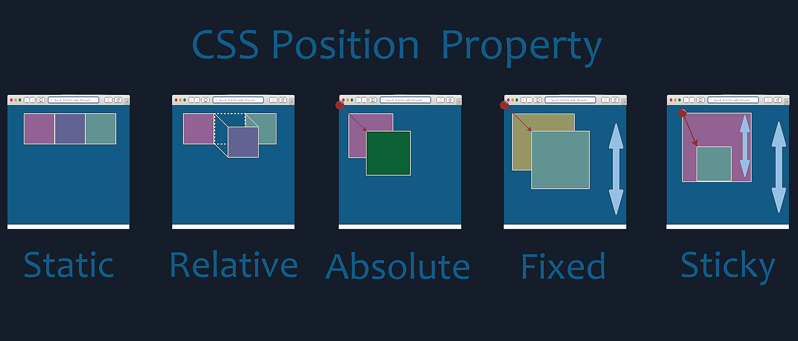

## CSS position

position 속성 : html 요소 배치 방법 정의하는 속성

### static
  - element가 HTML 문서의 일반적 흐름 따라 배치
  - element에 position 미지정시 적용
  - top, right, bottom, left, z-index 등 속성 영향 받지 않음

### relative
  - element가 HTML 문서의 일반적 흐름 따라 배치
  - position 미지정시 static과 같은 위치에 배치
  - element가 자신의 static 위치에서 top, right, bottom, left 등 속성에 대해 상대적인 위치에 배치
  - relative로 지정한 element는 다른 요소 위치에 영향 주지 않음

### absolute
  - 가장 가까운 부모 element에 대해 상대적 위치로 배치
  - 조상 element 없는 경우 body 기준 삼고 스크롤 따라 이동

### fixed
  - 스크린 viewport 기준 고정된 위치에 배치
    - viewport : 웹페이지가 사용자에게 보이는 영역
  - 스크롤해도 변화없음

### sticky
  - element가 HTML 문서의 일반적 흐름 따라 배치
  - top, right, bottom, left 속성값 기준으로 flow root 및 해당 element 포함하는 containing block에 대한 상대적 위치에 배치
  - fixed와 같으나 문서 흐름 따라 배치되는 차이
    - fixed 사용시 element 겹쳐보일 수 있으나, sticky의 경우 이러한 상황 예방 가능
